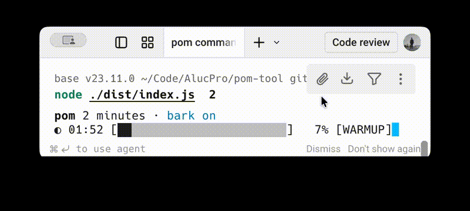

# pom-tool

> A terminal-native Pomodoro CLI with Bark notifications and a distinctive focus UI.

`pom-tool` is a lightweight Node.js terminal app for running Pomodoro sessions, tracking your focus time, and sending a completion notification to your iPhone with Bark.

Unlike generic Pomodoro apps, this one is built around two hooks:

- **Bark-first completion alerts** so your phone tells you when focus time is over
- **terminal-native UI** with an ink-style countdown, stage-based color shifts, and a progress bar that feels good to watch

If you want a Pomodoro timer that is:

- fast to start
- pleasant in the terminal
- useful enough to keep using every day
- simple enough to trust

this is the one.




## Why people like it

- **One command to start focus mode**: `pom 25`
- **Distinctive terminal UI**: ink-style countdown, stage labels, progress bar, readable status
- **Real stats**: today, 7-day average, 30-day average, total completed sessions
- **Phone notification on completion**: works with Bark on iPhone
- **No app switching**: stay inside your terminal and keep working
- **Tiny mental overhead**: easy enough to use dozens of times a day
- **Version check built in**: `pom -v` or `pom --version`

## Install

Use it instantly:

```bash
npx pom-tool 25
```

Or install globally:

```bash
npm i -g pom-tool
```

Then run:

```bash
pom 25
```

## Quick Start

Start a 25-minute Pomodoro:

```bash
pom 25
```

See your focus stats:

```bash
pom status
```

Configure Bark:

```bash
pom bark
```

Or set Bark non-interactively:

```bash
pom bark --url https://api.day.app/<your_key>
```

Show help:

```bash
pom --help
```

Show current version:

```bash
pom -v
```

## What It Does

### 1. Start a Pomodoro in seconds

```bash
pom 25
```

You get:

- an immediate ink-style countdown in your terminal
- a progress bar in the `████░░░░` style
- stage-based visual shifts like `WARMUP`, `FLOW`, `PUSH`, and `FINISH`
- a short completion animation when the session ends
- a clean completion panel
- a terminal bell when the session ends
- a system voice reminder on macOS
- an optional Bark push notification when the session is finished

### 2. See whether you are actually focusing

```bash
pom status
```

`pom status` shows:

- today's focused minutes
- average minutes per day in the last 7 days
- average minutes per day in the last 30 days
- total completed sessions
- Bark configuration status
- last completed Pomodoro timestamp

### 3. Push the finish alert to your phone

If you use [Bark](https://github.com/Finb/Bark), `pom-tool` can notify your iPhone when a Pomodoro is done.

Setup:

1. Open Bark on your iPhone.
2. Copy your Bark URL. It usually looks like `https://api.day.app/<your_key>`.
3. Run:

```bash
pom bark
```

Or:

```bash
pom bark --url https://api.day.app/<your_key>
```

### 4. Check the installed version

```bash
pom -v
pom --version
```

## Why This Project Stands Out

Most Pomodoro tools are either:

- too generic
- too visual-heavy
- too disconnected from terminal workflows

`pom-tool` is different because it sits at the intersection of:

- productivity
- terminal tooling
- indie hacker workflows
- iPhone notification automation
- terminal-native visual feedback
- CLI ergonomics with almost no setup friction

That combination makes it easier to:

- screenshot
- demo in a tweet/video
- share in dev communities
- adopt immediately with one command

If you like the tool, star the repo and share your terminal setup.

## Common Use Cases

- Developers using Pomodoro without leaving Neovim, VS Code terminal, or tmux
- Remote workers who want a phone notification when focus time ends
- People trying to build a daily deep-work habit
- Makers who want a tiny CLI instead of a heavy desktop app

## Development

This repo uses **TypeScript + pnpm**.

Clone and install:

```bash
git clone https://github.com/AlucPro/pom-tool.git
cd pom-tool
pnpm install
```

Build:

```bash
pnpm build
```

Run locally:

```bash
node dist/index.js 25
```

Or with the dev script:

```bash
pnpm dev -- 25
```

Link globally for local testing:

```bash
pnpm build
pnpm link --global
pom 25
```

Unlink:

```bash
pnpm unlink --global pom-tool
```

## Requirements

- Node.js 18+

## Versioning

This package follows Semantic Versioning: `MAJOR.MINOR.PATCH`.

## License

[MIT](./LICENSE)
